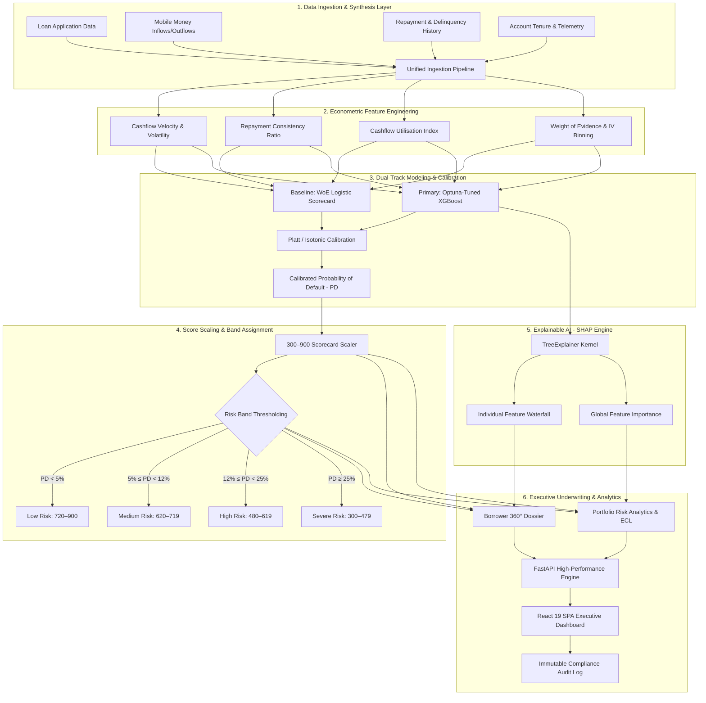

# Trustline Insight — Ultimate Master Architecture & Execution Plan

> **Executive Vision**: Build an institutional-grade, sovereign-ready credit risk intelligence platform combining alternative digital data, econometric credit scorecards, calibrated machine learning (XGBoost), and explainable AI (SHAP) for digital lenders, financial institutions, and central bank regulatory oversight across Kenya and East Africa.

---

## 🏛️ Executive Summary & Sovereign Context

In developing financial ecosystems like Kenya and the broader East African Community (EAC), over **70% of micro, small, and medium enterprises (MSMEs)** operate in the informal economy without traditional collateral or multi-year Credit Reference Bureau (CRB) histories. Traditional commercial banking algorithms systematically classify these creditworthy entrepreneurs as "unscorable," creating an estimated **$19B credit gap** across the region.

**Trustline Insight** bridges this information asymmetry by transforming mobile wallet transactions (M-Pesa, Airtel Money), cashflow velocity, utility payments, and repayment histories into transparent, audit-ready credit scores (300–900 scale), calibrated default probabilities, and directional feature-attribution waterfalls.

This master plan synthesizes the best data science, machine learning, econometric scoring, and enterprise backend patterns from three benchmark industry repositories into a unified, sovereign-ready software platform.

---

## 🔬 Benchmark Repository Synthesis

```
                                  TRUSTLINE INSIGHT
                                          │
            ┌─────────────────────────────┼─────────────────────────────┐
            ▼                             ▼                             ▼
   REPOSITORY 1 (Rahul9121)      REPOSITORY 2 (shashi-hue)    REPOSITORY 3 (ParasJain03)
 Banking Risk & Default Pred.    Loan Default Risk System       Credit Risk Scorecard
 ────────────────────────────    ─────────────────────────    ───────────────────────────
 • Enterprise System Pipeline    • Advanced ML & Optuna       • Classical WoE / IV
 • FastAPI Scoring Engine        • Business Threshold Curves  • PD → 300–900 Score Formula
 • SQL Portfolio Analytics       • Local SHAP Waterfalls      • Platt / Isotonic Calibration
 • Render Cloud Deployment       • Confusion Matrix & Curves  • IFRS-9 / ECL Provisioning
            │                             │                             │
            └─────────────────────────────┼─────────────────────────────┘
                                          ▼
                     THE UNIFIED TRUSTLINE PLATFORM
   (React 19 SPA • FastAPI Microservice • XGBoost + WoE Scorecard • SHAP XAI)
```

### 1. Repository #1: Banking Risk & Loan Default Prediction (`Rahul9121`)
- **Key Takeaway**: Enterprise backend architecture and containerized API layer.
- **Architectural Contribution**:
  - Structured modular design: `src/`, `api/`, `scripts/`, `data/`, `models/`, `sql/`.
  - Production FastAPI endpoint design (`POST /api/v1/predict`, `GET /api/v1/portfolio`).
  - Render-ready multi-stage Docker build and deployment manifest.
  - SQL-driven portfolio risk slicing and delinquency vintage queries.

### 2. Repository #2: Loan Default Risk System (`shashi-hue`)
- **Key Takeaway**: Production machine learning pipeline and explainability engine.
- **Architectural Contribution**:
  - **Bayesian Hyperparameter Optimization**: Automated tuning with Optuna over XGBoost objective spaces.
  - **Business-Aligned Thresholding**: Optimization of decision boundaries based on financial cost-benefit matrices rather than arbitrary $p > 0.5$ cutoffs (e.g. balancing approval rate vs default loss).
  - **SHAP Feature Attributions**: Local TreeExplainer attribution waterfalls explaining the exact contribution of each feature to the final probability.
  - **Advanced Statistical Validation**: Precision-Recall AUC, ROC curves, and KS statistic tracking.

### 3. Repository #3: Credit Risk Scorecard (`ParasJain03`)
- **Key Takeaway**: Classical econometric credit scoring, regulatory compliance, and IFRS-9 framework.
- **Architectural Contribution**:
  - **Weight of Evidence (WoE) & Information Value (IV)**: Coarse classing of non-linear financial variables for interpretability and linear logistic scorecards.
  - **Probability-to-Score Scaling**: Calibrated transformation formula converting PD into a standard 300–900 FICO-style credit score ($Score = Offset - Factor \times \ln(Odds)$).
  - **Probability Calibration**: Platt scaling and Isotonic regression to align raw model outputs with empirical default frequencies.
  - **IFRS-9 Expected Credit Loss (ECL)**: Three-stage macroeconomic provisioning model ($ECL = EAD \times PD \times LGD$).

---

## 📐 End-to-End System Blueprint



---

## 🗺️ Implementation Roadmap: Easiest to Hardest

Here is the complete step-by-step master plan ordered strictly from the easiest component to implement up to the most complex, with comprehensive technical rationales and tooling breakdowns.

```
┌────────────────────────────────────────────────────────────────────────────┐
│                       IMPLEMENTATION DIFFICULTY SCALE                      │
│                                                                            │
│  [1. Frontend UI] ─────────► [2. Synthetic Data] ────► [3. FastAPI Backend]│
│       (Easiest)                     (Easy)                   (Medium)      │
│                                                                            │
│  [4. WoE Scorecard] ───────► [5. XGBoost + Optuna] ─► [6. SHAP Engine]     │
│     (Medium-Hard)                   (Hard)                   (Hard)        │
│                                                                            │
│  [7. IFRS-9 / ECL Models] ─► [8. High-Throughput Real-Time Streaming]     │
│       (Very Hard)                         (Hardest)                        │
└────────────────────────────────────────────────────────────────────────────┘
```

---

### Step 1: Frontend SPA Shell & Financial UI Tokens (EASIEST)

#### Why It Is the Easiest
The frontend visual foundation relies on well-established declarative component libraries, modern CSS tokens, and static component composition without external distributed state or statistical math dependencies.

#### What We Build
- React 19 + TypeScript + Vite 8 SPA application foundation.
- Full design system in `src/styles.css` using deep navy/charcoal surfaces, restrained blue brand tokens, and semantic financial risk badges (`bg-risk-low-soft`, `bg-risk-medium-soft`, `bg-risk-high-soft`, `bg-risk-severe-soft`).
- TanStack Router typed file-based navigation across 25+ institutional routes.
- Shared visual primitives: semi-circular `ScoreGauge` (300–900), `ContributionBars` (SHAP waterfalls), `KpiCard` with trend badges, and responsive tables with CSV exporters.
- 1-Click Evaluation Sandbox with preloaded supervisor persona (**Dr. Sarah Kimani, Head of Credit Risk**).

#### Tools & Dependencies
| Tool / Library | Version | Purpose & Rationale |
| :--- | :--- | :--- |
| **React** | `19.2` | Core declarative UI library with concurrent rendering. |
| **TypeScript** | `5.8` | Strict type-safety matching backend API schemas. |
| **Vite** | `8.1` | Ultra-fast HMR and optimized static rollup bundling. |
| **Tailwind CSS** | `v4` | Modern CSS engine utilizing semantic CSS variables. |
| **@tanstack/react-router** | `1.170` | 100% type-safe client-side routing with deep link search params. |
| **Recharts** | `2.15` | Composable SVG financial charts (ROC, calibration, bar, area). |
| **Lucide React** | `1.16` | Clean, institutional financial icon suite. |
| **Sonner** | `2.0` | High-polish notification toast engine. |

---

### Step 2: Synthetic Data Engineering & Kenyan Alternative Schemas (EASY-MEDIUM)

#### Why It Is Easy-Medium
Generating synthetic data requires domain modeling and statistical parameter distributions (e.g. log-normal income distributions, Weibull default rates), but does not require live third-party network connections or asynchronous pipeline orchestration.

#### What We Build
- Synthetic generator producing 52+ realistic borrower archetypes across 4 Kenyan economic segments:
  1. **Salaried Employees** (Consistent monthly payroll, low cashflow volatility).
  2. **Micro-Retail Merchants** (Daily M-Pesa Till/Paybill receipts, moderate cashflow spikes).
  3. **Informal Market Traders** (High cash velocity, cyclical weekend revenue, thin formal files).
  4. **Smallholder Farmers** (Seasonal quarterly inflows, climate/harvest sensitivity).
- Complete data models for `Borrower`, `Application`, `Loan`, `RepaymentEvent`, `TransactionBehaviour`, and `AuditEvent`.
- Synthetic Kenyan geography (Nairobi, Mombasa, Kiambu, Nakuru, Kisumu, Eldoret) and currency notation in **Kenyan Shillings (KES)**.

#### Tools & Dependencies
| Tool / Library | Version | Purpose & Rationale |
| :--- | :--- | :--- |
| **Faker / Custom Seed Generator** | `TypeScript` | Deterministic reproducible dataset generator. |
| **NumPy / Pandas** | `2.2 / 2.2` | Matrix operations and distribution sampling in Python. |
| **Pydantic** | `v2.10` | Strict data validation and runtime schema parsing. |

---

### Step 3: Enterprise FastAPI Microservice & REST Architecture (MEDIUM)

#### Why It Is Medium
Connecting the frontend to an asynchronous Python backend requires structured REST contract design, CORS configuration, authentication middleware, error handling, and cloud containerization on Render/Fly.io.

#### What We Build
- Asynchronous FastAPI backend following the Repository 1 clean folder pattern:
  - `src/api/v1/routes/risk.py`: `/score`, `/batch-score`, `/simulate`.
  - `src/api/v1/routes/applications.py`: CRUD, underwriting decisions, status filters.
  - `src/api/v1/routes/borrowers.py`: 360° dossiers and 12-month transaction histories.
  - `src/api/v1/routes/portfolio.py`: Capital exposure, vintage curves, KPI summaries.
  - `src/api/v1/routes/model.py`: Model cards, ROC/PR curve data, PSI drift statistics.
- Direct frontend client abstraction (`src/api/client.ts`) capable of switching between local demo fixtures and live FastAPI backend using `VITE_API_URL`.
- Multi-stage Dockerfile and Render blueprint configuration (`render.yaml`).

#### Tools & Dependencies
| Tool / Library | Version | Purpose & Rationale |
| :--- | :--- | :--- |
| **FastAPI** | `0.115` | Modern, high-performance async Python web framework. |
| **Uvicorn / Gunicorn** | `0.34` | ASGI production server with async worker pools. |
| **Pydantic v2** | `2.10` | High-speed Rust-powered JSON validation. |
| **SQLAlchemy / SQLModel** | `2.0` | Async ORM and SQL query builder. |
| **PostgreSQL** | `16` | Enterprise relational database for immutable transactional storage. |
| **Docker** | `Multi-stage` | Reproducible deployment image minimizing container footprint. |

---

### Step 4: Econometric Feature Engineering & Scorecard Logic (MEDIUM-HARD)

#### Why It Is Medium-Hard
Classical credit risk scorecard methodology requires calculating **Weight of Evidence (WoE)** and **Information Value (IV)** across continuous features, binning non-monotonic variables, and applying mathematical scaling to convert log-odds into standard credit points.

#### What We Build
- Automated feature transformations:
  - **Cashflow Utilisation Index**: $\text{Utilisation} = \frac{\text{Average Monthly Outflows} + \text{Loan Payment}}{\text{Average Monthly Inflows}}$.
  - **Repayment Consistency Ratio**: Percentage of on-time installment payments over trailing 12 months.
  - **Cashflow Volatility Index**: Normalized standard deviation of weekly net mobile cashflows.
  - **Mobile Account Tenure**: Duration in months of active verified digital wallet statements.
- **Weight of Evidence (WoE) Transformer**:
  $$\text{WoE}_i = \ln\left(\frac{\% \text{ Good}_i}{\% \text{ Bad}_i}\right)$$
- **Information Value (IV) Ranking**:
  $$\text{IV} = \sum (\% \text{ Good}_i - \% \text{ Bad}_i) \times \text{WoE}_i$$
  Filter out weak features ($\text{IV} < 0.02$) and retain highly predictive signals ($\text{IV} \ge 0.10$).
- **FICO-Style 300–900 Score Scaling**:
  $$\text{Score} = \text{Offset} + \text{Factor} \times \ln\left(\frac{1 - \text{PD}}{\text{PD}}\right)$$
  Calibrated with target score of 600 at 50:1 odds and 20 points to double the odds (PDO).

#### Tools & Dependencies
| Tool / Library | Version | Purpose & Rationale |
| :--- | :--- | :--- |
| **Scikit-Learn** | `1.6` | Base transformers, pipelines, and logistic regression. |
| **OptBinning / Scorecardpy** | `0.19` | Specialized credit risk optimal monotonic WoE binning. |
| **Pandas / Polars** | `2.2 / 1.2` | High-throughput columnar feature transformations. |

---

### Step 5: Advanced Machine Learning Core (XGBoost + Optuna + Calibration) (HARD)

#### Why It Is Hard
Gradient boosted decision trees can overfit thin-file credit data and output uncalibrated probabilities. We must implement cross-validated Bayesian hyperparameter tuning, cost-sensitive learning to handle class imbalance (e.g. 5–10% default rates), and rigorous post-hoc calibration.

#### What We Build
- **XGBoost Classifier**: Non-linear gradient boosted tree engine modeling complex interaction effects between alternative mobile cashflows.
- **Optuna Hyperparameter Optimization**: Automated 100-trial Bayesian search optimizing validation PR-AUC across:
  - `max_depth` (3 to 8), `learning_rate` (0.01 to 0.15), `subsample` (0.6 to 0.9), `colsample_bytree` (0.6 to 0.9), `scale_pos_weight` (accounting for default imbalance).
- **Probability Calibration Layer**:
  - Platt Scaling (Sigmoid Logistic Calibration) & Isotonic Regression.
  - Brier score reduction and 10-bin calibration curve generation.
- **Business-Aligned Threshold Optimization**:
  - Cost-benefit utility curve balancing the cost of false positives (lost interest income on good loans) vs false negatives (principal loss on defaulted loans).
  - Multi-tier decision cutoffs: Fast-track Auto-Approve ($\text{PD} \le 3.5\%$), Standard Underwriting ($3.5\% < \text{PD} \le 12\%$), Senior Committee Referral ($12\% < \text{PD} \le 25\%$), Auto-Decline ($\text{PD} > 25\%$).

#### Tools & Dependencies
| Tool / Library | Version | Purpose & Rationale |
| :--- | :--- | :--- |
| **XGBoost** | `2.1` | State-of-the-art gradient boosted decision tree library. |
| **Optuna** | `4.2` | Bayesian hyperparameter search framework with pruning. |
| **CalibratedClassifierCV** | `Scikit-Learn` | Out-of-fold probability calibration. |
| **Joblib / ONNX** | `1.4` | Serialized model artifact persistence and low-latency inference. |

---

### Step 6: Explainable AI Engine & SHAP Regulatory Attribution (HARD)

#### Why It Is Hard
Tree-based SHAP calculations require computing Shapley values over game-theoretic feature permutations. Aligning local attribution waterfalls with human-readable underwriting explanations and central bank compliance rules (e.g. adverse action notices) requires strict mathematical fidelity.

#### What We Build
- **TreeExplainer Integration**:
  - Exact Shapley values computed in $<10\text{ms}$ per applicant.
  - Local feature attribution decomposition:
    $$\text{Log-Odds}(x) = \phi_0 + \sum_{j=1}^{M} \phi_j(x)$$
- **Adverse Action Generator**:
  - Automatic extraction of the top positive risk contributors (e.g. "High cashflow utilisation added +24 points to risk", "Recent 15-day DPD added +18 points to risk").
  - Clear, non-discriminatory adverse action notices compliant with Central Bank of Kenya Consumer Protection Guidelines.
- **Global Feature Importance & Dependence Plots**:
  - Mean absolute SHAP value rankings across portfolio segments.
  - Interactive dependence plots showing threshold tipping points for cashflow volatility and account tenure.

#### Tools & Dependencies
| Tool / Library | Version | Purpose & Rationale |
| :--- | :--- | :--- |
| **SHAP** | `0.46` | Unified game-theoretic feature importance calculation. |
| **TreeExplainer** | `SHAP C++ Core` | High-speed C-optimized tree traversal for real-time inference. |
| **Matplotlib / Seaborn** | `3.10` | Export of high-resolution regulatory summary artifacts. |

---

### Step 7: IFRS-9 Expected Credit Loss & Dynamic Portfolio Simulation (VERY HARD)

#### Why It Is Very Hard
IFRS-9 compliance is the global standard for banking regulation. It requires staging loans into three risk categories (Stage 1: Performing, Stage 2: Underperforming / Significant Increase in Credit Risk, Stage 3: Defaulted) and computing forward-looking lifetime credit losses under varying macroeconomic scenarios.

#### What We Build
- **IFRS-9 Staging Classifier**:
  - **Stage 1 (12-Month ECL)**: Borrowers with stable PD since origination ($\Delta\text{PD} < 100\%$, $\text{DPD} \le 30$).
  - **Stage 2 (Lifetime ECL)**: Borrowers experiencing Significant Increase in Credit Risk (SICR) ($\Delta\text{PD} \ge 100\%$, $30 < \text{DPD} \le 90$).
  - **Stage 3 (Credit Impaired)**: Defaulted loans ($\text{DPD} > 90$ or formal default event).
- **Expected Credit Loss (ECL) Calculation Engine**:
  $$\text{ECL} = \text{EAD} \times \text{PD} \times \text{LGD}$$
  - $\text{EAD}$ (Exposure at Default): Outstanding principal + committed liquidity.
  - $\text{PD}$ (Probability of Default): Forward-looking 12-month or Lifetime calibrated PD.
  - $\text{LGD}$ (Loss Given Default): Segment-calibrated recovery discount (e.g. $45\%$ for uncollateralized MSME mobile facilities).
- **Dynamic Stress-Testing Simulator**:
  - Simulates macroeconomic shocks (inflation surge, interest rate hike, seasonal agricultural drought) and recalculates portfolio loss provisions in real time.

#### Tools & Dependencies
| Tool / Library | Version | Purpose & Rationale |
| :--- | :--- | :--- |
| **NumPy Financial** | `1.0` | Net present value, cash flow amortization, and discount curves. |
| **Statsmodels** | `0.14` | Econometric time-series autoregression for macroeconomic shocks. |
| **Polars** | `1.2` | High-speed portfolio aggregation across millions of synthetic records. |

---

### Step 8: High-Throughput Model Serving & Drift Monitoring (HARDEST)

#### Why It Is the Hardest
Real-time financial infrastructure requires sub-50ms inference latency, concurrent connection pooling, zero-downtime model hot-swapping, automated covariate drift detection (Population Stability Index - PSI), and immutable cryptographic audit logging.

#### What We Build
- **Sub-50ms Inference Pipeline**:
  - Pre-compiled ONNX Runtime / C-accelerated XGBoost execution.
  - In-memory feature preprocessing and caching using Redis / FastCache.
- **Covariate Drift & Stability Monitoring**:
  - **Population Stability Index (PSI)** calculation per feature:
    $$\text{PSI} = \sum \left(\text{Actual } \% - \text{Expected } \%\right) \times \ln\left(\frac{\text{Actual } \%}{\text{Expected } \%}\right)$$
  - Automated alerting: $\text{PSI} < 0.10$ (Stable), $0.10 \le \text{PSI} < 0.25$ (Moderate Shift), $\text{PSI} \ge 0.25$ (Critical Drift $\to$ Automated Retrain Trigger).
- **Immutable Compliance Audit Stream**:
  - Cryptographically hashed event trail capturing input vector, model version, calculated PD, SHAP attributions, timestamp, underwriter ID, and final decision.

#### Tools & Dependencies
| Tool / Library | Version | Purpose & Rationale |
| :--- | :--- | :--- |
| **ONNX Runtime** | `1.20` | Cross-platform, high-performance ML inference runtime. |
| **Redis / KeyDB** | `7.4` | In-memory feature caching and high-speed rate limiting. |
| **Evidently AI / NannyML** | `0.4` | Enterprise data drift and model monitoring framework. |
| **Prometheus & Grafana** | `2.50` | Real-time telemetry, latency histograms, and uptime monitoring. |

---

## 🧰 Comprehensive Tooling & Technology Matrix

```
┌────────────────────────┬─────────────────────────────┬──────────────────────────────────────────────────┐
│ DOMAIN                 │ TECHNOLOGY / TOOL           │ PURPOSE & JUSTIFICATION                          │
├────────────────────────┼─────────────────────────────┼──────────────────────────────────────────────────┤
│ Frontend SPA           │ React 19 + TypeScript 5.8   │ Type-safe, high-performance client interface     │
│ Frontend Routing       │ @tanstack/react-router      │ Typed file-based routing with deep-link state    │
│ Frontend Styling       │ Tailwind CSS v4             │ Semantic financial risk design tokens & utilities│
│ Data Visualization     │ Recharts + Framer Motion    │ Financial curves, ROC, SHAP waterfalls, gauges   │
│ Backend Web API        │ FastAPI + Uvicorn           │ Asynchronous high-throughput REST scoring engine │
│ Validation & Schemas   │ Pydantic v2                 │ Rust-accelerated schema validation & typing      │
│ Database & ORM         │ PostgreSQL + SQLAlchemy 2.0 │ ACID relational storage for loans & audit events │
│ Classical Scorecards   │ OptBinning + Scikit-Learn   │ Weight of Evidence (WoE) & Information Value     │
│ Machine Learning       │ XGBoost 2.1 + Optuna 4.2    │ Gradient boosted decision trees & Bayesian tuning│
│ Probability Calib.     │ Platt Sigmoid + Isotonic    │ Empirically accurate probability calibration     │
│ Explainable AI         │ SHAP (TreeExplainer)        │ Local feature attribution waterfalls & reasoning │
│ Regulatory Provision   │ NumPy Financial + Statsmodels│ IFRS-9 ECL (PD x LGD x EAD) & Stress Testing     │
│ High-Speed Inference   │ ONNX Runtime                │ Sub-50ms production model evaluation             │
│ Model Monitoring       │ Evidently AI + PSI Math     │ Population Stability Index & covariate drift     │
│ Deployment & Edge      │ Vercel (SPA) + Render (API) │ Zero-config cloud CDN and container hosting      │
└────────────────────────┴─────────────────────────────┴──────────────────────────────────────────────────┘
```

---

## 🚀 Execution & Operational Workflow

### Daily Development & Dual-Remote Git Synchronization
Per user instructions, all commits are synchronized across both organization and personal GitHub repositories via the configured unified alias:

```bash
# Push to both repositories simultaneously
git pushall
```

Which executes:
```bash
git push org-origin main
git push personal main
```

---

*© 2026 BuiltbyRushion Engineering. Nairobi, Kenya.*
